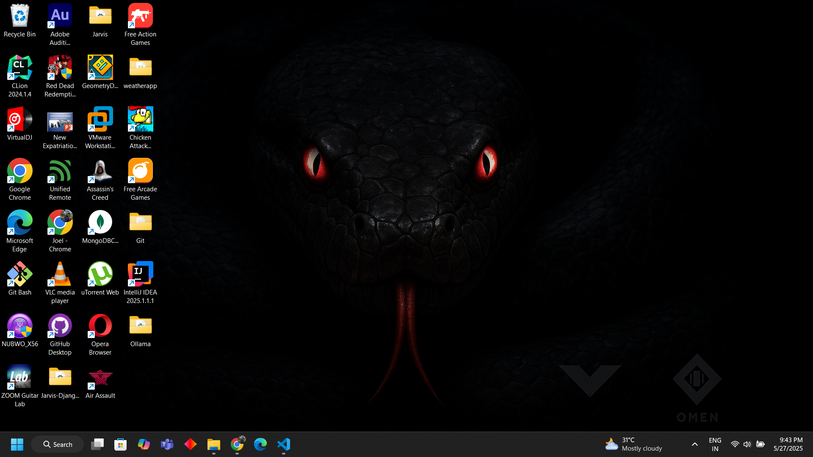

## 📸 Python Screenshot Capture Tool



This repository contains two Python scripts that allow users to take screenshots easily using the `pyautogui` library. One script features a **Graphical User Interface (GUI)** using `tkinter`, and the other is a **console-based version** for lightweight usage.

---

### ✨ Features

* Captures full-screen screenshots.
* Auto-saves images with **timestamped filenames**.
* Stores screenshots in a dedicated `Screenshots` folder.
* Opens the screenshot automatically after capture.
* GUI version: Click a button to take screenshots.
* Console version: Simple script, no window required.

---

### 🧰 Requirements

* Python 3.x
* Modules:

  * `pyautogui`
  * `tkinter` (comes with Python)
  * `Pillow` (auto-installed with pyautogui)

---

### ⚙️ Installation

1. Clone this repository or download the `.py` files.

2. Create and activate a virtual environment (optional but recommended):

   ```bash
   python -m venv env
   source env/bin/activate  # On Windows: env\Scripts\activate
   ```

3. Install required packages:

   ```bash
   pip install pyautogui
   ```

---

### ▶️ Usage

#### 1. **GUI Version**

**File:** `screenshot_gui.py`

```bash
python screenshot_gui.py
```

* A small window will open with **"Take Screenshot"** and **"Quit"** buttons.
* After clicking "Take Screenshot", the window hides for 2 seconds and then captures the screen.
* The screenshot is saved and opened automatically.

#### 2. **Console Version**

**File:** `screenshot_cli.py`

```bash
python screenshot_cli.py
```

* Prints a message and waits 2 seconds.
* Takes a screenshot and saves it in the `Screenshots` folder.
* Opens the screenshot using your system's default image viewer.

---

### 📁 Folder Structure

```
📦 ScreenshotTool
├── 📁 Screenshots           # Automatically created to store images
├── screenshot_gui.py        # GUI version
├── screenshot_cli.py        # Console version
└── README.md
---
